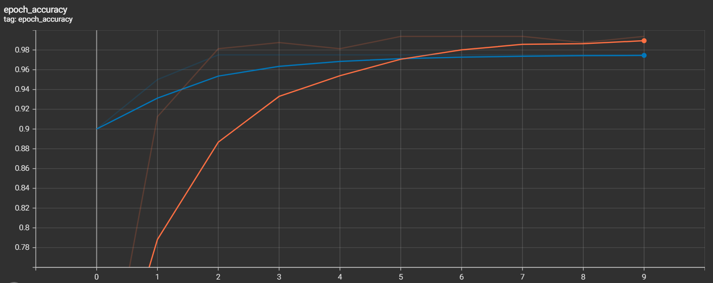

# VGG1:

### Accuracy:
Orange: Training
Blue: Validation

### Loss:
Orange: Training
Blue: Validation

### Test Images:

# VGG3:

### Accuracy:
Orange: Training
Blue: Validation

### Loss:
Orange: Training
Blue: Validation

### Test Images:

# VGG3 with Aug:

### Accuracy:
Orange: Training
Blue: Validation

### Loss:
Orange: Training
Blue: Validation

### Test Images:

# VGG16:

### Accuracy:
Orange: Training
Blue: Validation

### Loss:
Orange: Training
Blue: Validation

### Test Images:

# MLP:

### Accuracy:
Orange: Training
Blue: Validation

### Loss:
Orange: Training
Blue: Validation

### Test Images:

